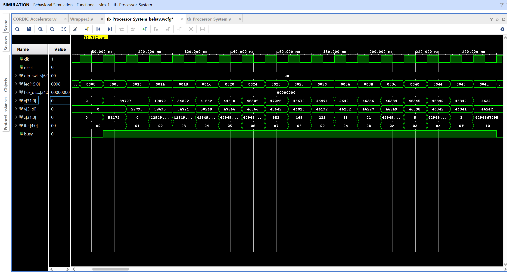

# Custom Motor-Control SoC (ARM Architecture) 🚀

## Overview
This repository contains the RTL design of a custom System-on-Chip (SoC) optimized for **Field-Oriented Control (FOC)** of BLDC/PMSM motors. At its core is a 5-stage pipelined ARM microprocessor designed from scratch in Verilog, integrated with a custom Memory-Mapped I/O (MMIO) architecture to drive dedicated motor-control hardware peripherals.

This project was built to demonstrate hardware-software co-design, specifically offloading high-speed, deterministic motor driving tasks and complex mathematics from the CPU to dedicated silicon.

## Key Features
* **Custom Processor Core:** 5-stage pipelined ARM architecture with full hazard resolution (forwarding and stalling) and multi-cycle execution units.
* **Hardware Offloading via MMIO:** Custom address decoding allowing the CPU to configure hardware registers using standard Assembly `STR`/`LDR` instructions.
* **3-Phase Center-Aligned PWM Generator:** Designed specifically for FOC algorithms. It features a center-aligned up/down counter to ensure ADC phase-current sampling can occur synchronously with zero switching noise.
* **CORDIC Hardware Accelerator:** A 16-stage iterative coprocessor using Q16.16 fixed-point arithmetic to calculate Sine and Cosine concurrently in hardware.

## Hardware CORDIC Accelerator (FOC Math Coprocessor)
In Field-Oriented Control (FOC), calculating Sine and Cosine transformations (Clarke/Park) in software wastes hundreds of clock cycles. To optimize this, I designed a dedicated iterative **CORDIC coprocessor**. 

By writing the target phase angle to memory address `0x00000B00`, the CPU triggers the accelerator. As seen in the waveform below, the CORDIC computes both `Cos` (X) and `Sin` (Y) concurrently in exactly 16 clock cycles without relying on expensive hardware multipliers. The ARM processor then reads the results back via MMIO.


*(Simulation showing the CORDIC calculating Cos(45°) and Sin(45°), converging flawlessly to 46341 (0.7071 in Q16.16 format) in 16 cycles).*

## 3-Phase PWM Peripheral & Software Integration
As shown in the simulation waveform below, once the CPU writes the duty cycles to the hardware registers, the CPU halts (eafffffe branch loop), and the hardware autonomously generates the center-aligned pulses.


(The perfectly center-aligned pyramid structure of pwm_u, pwm_v, and pwm_w, which is mandatory for FOC).

## Upcoming Development (Roadmap)
⏳ QEI Peripheral: Quadrature Encoder Interface for accurate rotor position and speed tracking.
⏳ Hardware Clarke/Park Transform Blocks: Further hardware abstraction for the FOC algorithmic loop.

The PWM hardware is controlled seamlessly via software. Here is the assembly used to configure the 3-phase PWM hardware:

```armasm
LDR R0, =0x00000A00   // Load PWM Base Address 
MOV R2, #100          // PWM Period (Frequency)
MOV R3, #25           // Phase U Duty (25%)
MOV R4, #50           // Phase V Duty (50%)
MOV R5, #75           // Phase W Duty (75%)

STR R2, [R0, #0]      // Write Period to Hardware
STR R3, [R0, #4]      // Write Phase U
STR R4,[R0, #8]      // Write Phase V
STR R5, [R0, #12]     // Write Phase W
// CPU is now free to calculate other algorithms!