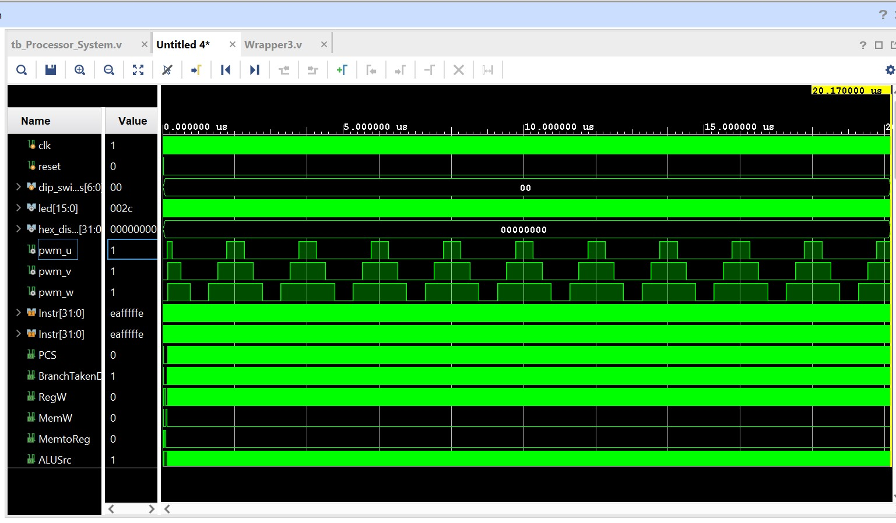

# Custom Motor-Control SoC (ARM Architecture) 🚀

## Overview
This repository contains the RTL design of a custom System-on-Chip (SoC) optimized for **Field-Oriented Control (FOC)** of BLDC/PMSM motors. At its core is a 5-stage pipelined ARM microprocessor designed from scratch in Verilog, integrated with a custom Memory-Mapped I/O (MMIO) architecture to drive dedicated motor-control hardware peripherals.

This project was built to demonstrate hardware-software co-design, specifically offloading high-speed, deterministic motor driving tasks from the CPU to dedicated silicon.

## Key Features
* **Custom Processor Core:** 5-stage pipelined ARM/RISC-V architecture with full hazard resolution (forwarding and stalling) and multi-cycle execution units.
* **Hardware Offloading via MMIO:** Custom address decoding (`0x00000A00` memory space) allowing the CPU to configure hardware registers using standard Assembly `STR` instructions.
* **3-Phase Center-Aligned PWM Generator:** Designed specifically for FOC algorithms. It features a center-aligned up/down counter to ensure ADC phase-current sampling can occur synchronously with zero switching noise.

## System Simulation & Verification
The CPU was programmed with compiled machine code to initialize the PWM peripheral. As shown in the simulation waveform below, once the CPU writes the duty cycles (25%, 50%, 75%) to the hardware registers, the CPU halts (`eafffffe` branch loop), and the **hardware autonomous generates the center-aligned pulses**.


*(Notice the perfectly center-aligned pyramid structure of `pwm_u`, `pwm_v`, and `pwm_w`, which is mandatory for FOC).*

## Software Integration (Assembly)
The hardware is controlled seamlessly via software. Here is the assembly used to configure the 3-phase PWM hardware:
```armasm
LDR R0, =0x00000A00   // Load PWM Base Address 
MOV R2, #100          // PWM Period (Frequency)
MOV R3, #25           // Phase U Duty (25%)
MOV R4, #50           // Phase V Duty (50%)
MOV R5, #75           // Phase W Duty (75%)

STR R2, [R0, #0]      // Write Period to Hardware
STR R3, [R0, #4]      // Write Phase U
STR R4,[R0, #8]      // Write Phase V
STR R5, [R0, #12]     // Write Phase W
// CPU is now free to calculate other algorithms!